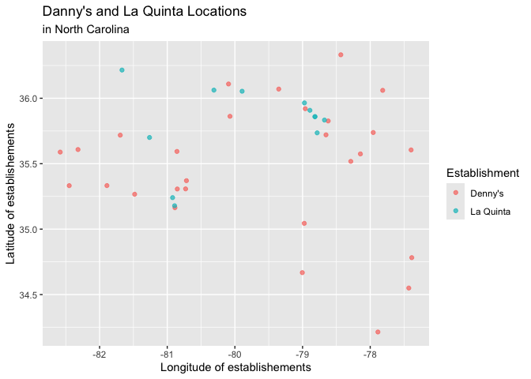

Lab 04 - La Quinta is Spanish for next to Denny’s, Pt. 1
================
Olivia Zhang
02/14/2025

### Load packages and data

``` r
#install.packages("devtools")
#devtools::install_github("rstudio-education/dsbox")

library(tidyverse) 
library(dsbox) 
```

``` r
states <- read_csv("data/states.csv")
```

### Exercise 1

The Denny’s dataset has 1643 rows and 6 columns/variables. Each row
represent a Denny’s location, and the variables are address, city,
state, zip, longitude, and latitude.

### Exercise 2

The La Quinta’s dataset has 909 rows and 6 columns/variables. Each row
represent a La Quinta’s location, and the variables are address, city,
state, zip, longitude, and latitude.

### Exercise 3

There are some La Quintas’ outside of US. They are in countries like
Canada, Mexico, China, New Zealand, Turkey, United Arab Emirates, Chile,
Colombia, Ecuador. However, I don’t think there’s any Danny’s outside of
the US.

### Exercise 4

There are two ways I can think of to determine whether there’s any
establishments that are not in the US.

1.  We can create a new variable called US and check weather the state
    variable in two datasets are the same or different from the
    abbreviation variable in the states dataset.

2.  If we know the longitude and latitude of all locations on the US
    border line, techniquely, we can filter out the establishments
    outside of US.

### Exercise 5

``` r
dn <- dennys %>%
  filter(!(state %in% states$abbreviation))
dn
```

    ## # A tibble: 0 × 6
    ## # ℹ 6 variables: address <chr>, city <chr>, state <chr>, zip <chr>,
    ## #   longitude <dbl>, latitude <dbl>

There are 0 Denny’s locations outside the US.

### Exercise 6

``` r
dennys <- dennys %>%
  mutate(country = "United States")
dennys
```

    ## # A tibble: 1,643 × 7
    ##    address                        city    state zip   longitude latitude country
    ##    <chr>                          <chr>   <chr> <chr>     <dbl>    <dbl> <chr>  
    ##  1 2900 Denali                    Anchor… AK    99503    -150.      61.2 United…
    ##  2 3850 Debarr Road               Anchor… AK    99508    -150.      61.2 United…
    ##  3 1929 Airport Way               Fairba… AK    99701    -148.      64.8 United…
    ##  4 230 Connector Dr               Auburn  AL    36849     -85.5     32.6 United…
    ##  5 224 Daniel Payne Drive N       Birmin… AL    35207     -86.8     33.6 United…
    ##  6 900 16th St S, Commons on Gree Birmin… AL    35294     -86.8     33.5 United…
    ##  7 5931 Alabama Highway, #157     Cullman AL    35056     -86.9     34.2 United…
    ##  8 2190 Ross Clark Circle         Dothan  AL    36301     -85.4     31.2 United…
    ##  9 900 Tyson Rd                   Hope H… AL    36043     -86.4     32.2 United…
    ## 10 4874 University Drive          Huntsv… AL    35816     -86.7     34.7 United…
    ## # ℹ 1,633 more rows

### Exercise 7

``` r
lq <- laquinta %>%
  filter(!(state %in% states$abbreviation))
lq
```

    ## # A tibble: 14 × 6
    ##    address                                  city  state zip   longitude latitude
    ##    <chr>                                    <chr> <chr> <chr>     <dbl>    <dbl>
    ##  1 Carretera Panamericana Sur KM 12         "\nA… AG    20345    -102.     21.8 
    ##  2 Av. Tulum Mza. 14 S.M. 4 Lote 2          "\nC… QR    77500     -86.8    21.2 
    ##  3 Ejercito Nacional 8211                   "Col… CH    32528    -106.     31.7 
    ##  4 Blvd. Aeropuerto 4001                    "Par… NL    66600    -100.     25.8 
    ##  5 Carrera 38 # 26-13 Avenida las Palmas c… "\nM… ANT   0500…     -75.6     6.22
    ##  6 AV. PINO SUAREZ No. 1001                 "Col… NL    64000    -100.     25.7 
    ##  7 Av. Fidel Velazquez #3000 Col. Central   "\nM… NL    64190    -100.     25.7 
    ##  8 63 King Street East                      "\nO… ON    L1H1…     -78.9    43.9 
    ##  9 Calle Las Torres-1 Colonia Reforma       "\nP… VE    93210     -97.4    20.6 
    ## 10 Blvd. Audi N. 3 Ciudad Modelo            "\nS… PU    75010     -97.8    19.2 
    ## 11 Ave. Zeta del Cochero No 407             "Col… PU    72810     -98.2    19.0 
    ## 12 Av. Benito Juarez 1230 B (Carretera 57)… "\nS… SL    78399    -101.     22.1 
    ## 13 Blvd. Fuerza Armadas                     "con… FM    11101     -87.2    14.1 
    ## 14 8640 Alexandra Rd                        "\nR… BC    V6X1…    -123.     49.2

There are 14 Denny’s locations outside the US.

### Exercise 8

``` r
laquinta <- laquinta %>%
  mutate(country = case_when(
    state %in% state.abb ~ "United States",
    state %in% c("ON", "BC") ~ "Canada",
    state == "ANT" ~ "Colombia",
    state == "FM" ~ "Honduras",
    state %in% c("AG", "QR", "CH", "NL", "VE", "PU", "SL") ~ "Mexico",
  ))
```

``` r
laquinta <- laquinta %>%
  filter(country == "United States")
```

### Exercise 9

``` r
dennys %>%
  count(state) %>%
  arrange(desc(n))
```

    ## # A tibble: 51 × 2
    ##    state     n
    ##    <chr> <int>
    ##  1 CA      403
    ##  2 TX      200
    ##  3 FL      140
    ##  4 AZ       83
    ##  5 IL       56
    ##  6 NY       56
    ##  7 WA       49
    ##  8 OH       44
    ##  9 MO       42
    ## 10 PA       40
    ## # ℹ 41 more rows

``` r
dennys %>%
  count(state) %>%
  arrange(n)
```

    ## # A tibble: 51 × 2
    ##    state     n
    ##    <chr> <int>
    ##  1 DE        1
    ##  2 DC        2
    ##  3 VT        2
    ##  4 AK        3
    ##  5 IA        3
    ##  6 NH        3
    ##  7 SD        3
    ##  8 WV        3
    ##  9 LA        4
    ## 10 MT        4
    ## # ℹ 41 more rows

``` r
laquinta %>%
  count(state) %>%
  arrange(desc(n))
```

    ## # A tibble: 48 × 2
    ##    state     n
    ##    <chr> <int>
    ##  1 TX      237
    ##  2 FL       74
    ##  3 CA       56
    ##  4 GA       41
    ##  5 TN       30
    ##  6 OK       29
    ##  7 LA       28
    ##  8 CO       27
    ##  9 NM       19
    ## 10 NY       19
    ## # ℹ 38 more rows

``` r
laquinta %>%
  count(state) %>%
  arrange(n)
```

    ## # A tibble: 48 × 2
    ##    state     n
    ##    <chr> <int>
    ##  1 ME        1
    ##  2 AK        2
    ##  3 NH        2
    ##  4 RI        2
    ##  5 SD        2
    ##  6 VT        2
    ##  7 WV        3
    ##  8 WY        3
    ##  9 IA        4
    ## 10 MI        4
    ## # ℹ 38 more rows

California (n = 403) has the most Denny’s locations and Delaware has the
least (n = 1); Texas (n = 237) has the most La Quinta’s locations and
Maine has the least (n = 1). Due to my limited knowledge of the US
demographic, I guess it’s not surprising, since Texas is near Mexico and
Maine is far north. I’m not sure why the location pattern of Danny’s is
this way though.

``` r
dennys %>%
  count(state) %>%
  inner_join(states, by = c("state" = "abbreviation")) %>% 
  mutate(per_th_sq_mile = n/area) %>%
  arrange(desc(per_th_sq_mile))
```

    ## # A tibble: 51 × 5
    ##    state     n name                     area per_th_sq_mile
    ##    <chr> <int> <chr>                   <dbl>          <dbl>
    ##  1 DC        2 District of Columbia     68.3       0.0293  
    ##  2 RI        5 Rhode Island           1545.        0.00324 
    ##  3 CA      403 California           163695.        0.00246 
    ##  4 CT       12 Connecticut            5543.        0.00216 
    ##  5 FL      140 Florida               65758.        0.00213 
    ##  6 MD       26 Maryland              12406.        0.00210 
    ##  7 NJ       10 New Jersey             8723.        0.00115 
    ##  8 NY       56 New York              54555.        0.00103 
    ##  9 IN       37 Indiana               36420.        0.00102 
    ## 10 OH       44 Ohio                  44826.        0.000982
    ## # ℹ 41 more rows

``` r
laquinta %>%
  count(state) %>%
  inner_join(states, by = c("state" = "abbreviation")) %>%
  mutate(per_th_sq_mile = n/area) %>%
  arrange(desc(per_th_sq_mile))
```

    ## # A tibble: 48 × 5
    ##    state     n name             area per_th_sq_mile
    ##    <chr> <int> <chr>           <dbl>          <dbl>
    ##  1 RI        2 Rhode Island    1545.       0.00129 
    ##  2 FL       74 Florida        65758.       0.00113 
    ##  3 CT        6 Connecticut     5543.       0.00108 
    ##  4 MD       13 Maryland       12406.       0.00105 
    ##  5 TX      237 Texas         268596.       0.000882
    ##  6 TN       30 Tennessee      42144.       0.000712
    ##  7 GA       41 Georgia        59425.       0.000690
    ##  8 NJ        5 New Jersey      8723.       0.000573
    ##  9 MA        6 Massachusetts  10554.       0.000568
    ## 10 LA       28 Louisiana      52378.       0.000535
    ## # ℹ 38 more rows

### Exercise 10

District of Columbia has the most Denny’s locations per thousand square
miles, and Rhode Island has the most La Quinta’s locations per thousand
square miles.

``` r
dennys <- dennys %>%
  mutate(establishment = "Denny's")
laquinta <- laquinta %>%
  mutate(establishment = "La Quinta")
```

``` r
dn_lq <- bind_rows(dennys, laquinta)
```

``` r
ggplot(dn_lq, mapping = aes(
  x = longitude,
  y = latitude,
  color = establishment
)) +
  geom_point()
```

<!-- -->

### Exercise 11

``` r
dn_lq %>%
  filter(state == "NC") %>%
  ggplot(dn_lq, mapping = aes(
    x = longitude,
    y = latitude,
    color = establishment
    )) +
  geom_point(alpha = .7) +
  labs(
  title = "Danny's and La Quinta Locations",
  subtitle = "in North Carolina",
  x = "Longitude of establishements", 
  y = "Latitude of establishements", 
  color = "Establishment"
     )
```

<!-- -->

Mitch Hedberg’s joke mostly hold in North Carolina except for a few La
Quintas on the upper left corner of the plot, which are distant from
their nearest Denny’s.

### Exercise 12

``` r
dn_lq %>%
  filter(state == "TX") %>%
  ggplot(dn_lq, mapping = aes(
    x = longitude,
    y = latitude,
    color = establishment
    )) +
  geom_point(alpha = .5) +
  labs(
  title = "Danny's and La Quinta Locations",
  subtitle = "in Texas",
  x = "Longitude of establishements", 
  y = "Latitude of establishements", 
  color = "Establishment"
     )
```

<!-- -->

Mitch Hedberg’s joke seems to hold less in Texas, since there are more
La Quintas than Denny’s, and not all La Quinta has a Denny’s next to it.
However, all Denny’s are near La Quintas. Maybe in Texas, Denny’s is the
English for “next to La Quinta”!
